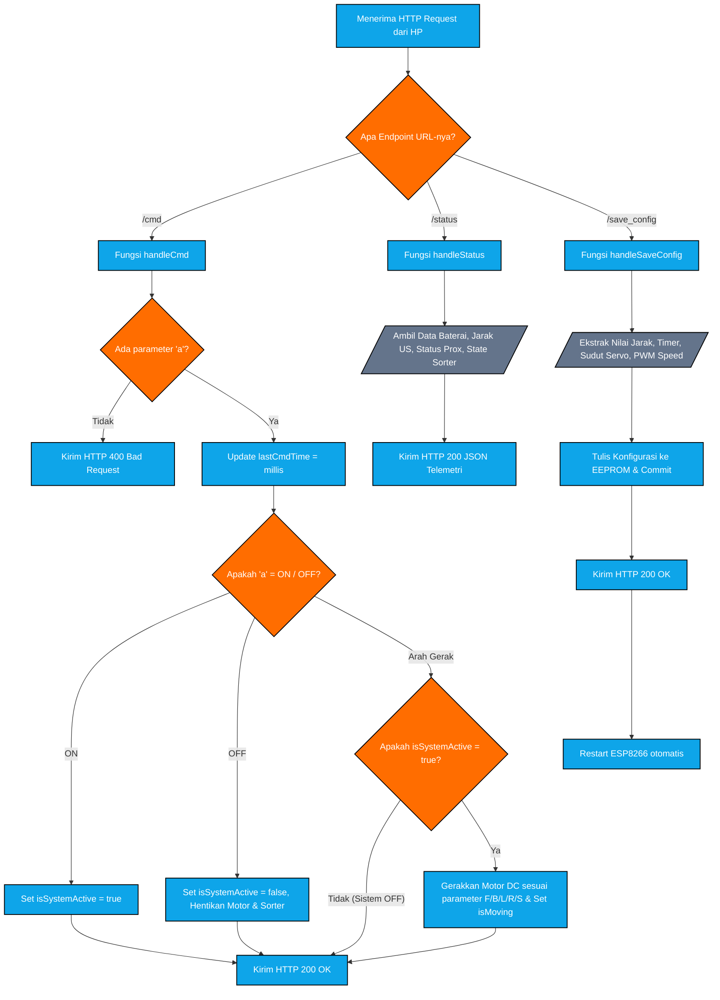

# AMOS — Automated Metal Object Sorter

AMOS adalah sistem pintar pemilah sampah logam dan non-logam otomatis berbasis IoT yang ditenagai oleh mikrokontroler **ESP8266 (NodeMCU)**. Alat ini dilengkapi dengan antarmuka web kustom (Web UI) responsif untuk mengontrol pergerakan robot secara nirkabel (RC Mode), memantau sensor secara *real-time*, dan mengalibrasi parameter hardware secara dinamis tanpa perlu melakukan pemrograman ulang (*flashing*).

---

## ✨ Fitur Utama

1. **🧠 Smart Hybrid Mode**
   - **Deteksi Objek Presisi**<br>Sensor Ultrasonik dipasang di dalam platform pemilahan untuk mendeteksi sampah (default jarak deteksi pemantauan <= 10 cm).
   - **Evaluasi Polling Pintar**<br>Ketika sampah dideteksi oleh Ultrasonik, sistem akan memulai waktu tunggu (Timer Evaluasi). Jika sensor Proximity mendeteksi logam sebelum waktu habis, servo akan langsung membuang sampah ke jalur **Logam**. Jika waktu habis tanpa deteksi logam, sampah dianggap **Non-Logam** dan dibuang ke jalur sebaliknya.
   - **Proteksi Platform Tersumbat**<br>Setelah proses pembuangan selesai, sistem mendeteksi platform sekali lagi. Jika sampah masih terdeteksi (karena tersumbat/nyangkut), robot masuk ke status aman `PLATFORM TERTUTUP` untuk melindungi servo dari eror pergerakan berulang.
   - **Abaikan US saat Membuang**<br>Sensor Ultrasonik diabaikan secara otomatis ketika pintu servo sedang terbuka guna menghindari deteksi palsu akibat gerakan daun pintu penutup.
   - **Nonaktif saat Berjalan**<br>Seluruh aktivitas sensor pembacaan sampah dinonaktifkan otomatis ketika robot dalam mode bergerak (RC Mode) agar hemat daya.

2. **⚙️ Kalibrasi Dinamis (EEPROM)**
   - Mengubah parameter sensitivitas secara instan dari menu Settings pada Web UI:
     - Jarak Pemantauan objek (cm).
     - Timer Evaluasi klasifikasi sampah (ms).
     - Kalibrasi sudut servo (Standby, Logam, Non-logam dalam derajat).
     - Delay servo membuka penutup sebelum kembali ke posisi awal (ms).
     - Kalibrasi kecepatan PWM motor roda kiri & kanan.
   - Seluruh nilai konfigurasi disimpan secara permanen di memori fisik EEPROM dan modul otomatis melakukan restart mandiri untuk menerapkan perubahan.

3. **🚀 Chunked Web Streaming & Optimalisasi RAM**
   - Halaman web dipecah secara modular menjadi file `web_ui.h`, `ui_css.h`, dan `ui_js.h` untuk mempermudah pemeliharaan kode.
   - Pengiriman data menggunakan metode Chunked Streaming (`server.sendContent_P`) langsung dari memori kilat (Flash Memory/PROGMEM). Hal ini membuat beban memori RAM aktif tetap minim (~0 byte terpakai) dan menghindari risiko crash/restart akibat fragmentasi memori (heap fragmentation).
   - Menggunakan pustaka ArduinoJson (v7.x.x) untuk pertukaran status JSON yang kokoh.

4. **🌐 Akses Web Tanpa IP (mDNS)**
   - Mendukung pencarian nama perangkat lokal. Cukup hubungkan ke hotspot robot dan ketik `http://amos.local` pada browser HP/Laptop untuk masuk ke antarmuka kontrol.

---

## 🔌 Skema Pin Out (NodeMCU ESP8266)

| Komponen | Pin Hardware | Keterangan |
| :--- | :--- | :--- |
| **Motor L298N IN1** | `D1` / GPIO5 | Kontrol Arah Motor Kiri (A) |
| **Motor L298N IN2** | `D2` / GPIO4 | Kontrol Arah Motor Kiri (B) |
| **Motor L298N IN3** | `D5` / GPIO14 | Kontrol Arah Motor Kanan (A) |
| **Motor L298N IN4** | `D6` / GPIO12 | Kontrol Arah Motor Kanan (B) |
| **Sensor Proximity** | `D3` / GPIO0 | Input Sensor Logam (NPN NO) |
| **Servo SG90** | `D4` / GPIO2 | Sinyal PWM Kontrol Servo |
| **Ultrasonic Trig** | `D8` / GPIO15 | Output Sinyal Trigger Sensor Jarak |
| **Ultrasonic Echo** | `D7` / GPIO13 | Input Sinyal Pantulan Gema |

---

## 📸 Dokumentasi Proyek
### 🤖 Fisik Robot AMOS
| Tampak Depan | Tampak Belakang |
| :---: | :---: |
|  |  |

### 🌐 Antarmuka Kontrol (Web UI)
| Control Hub (Power OFF) | Control Hub (Power ON) | Menu Konfigurasi Robot |
| :---: | :---: | :---: |
|  |  |  |

---

## 📊 Flowchart & Arsitektur Sistem
### 1. Alur Utama Program

```mermaid
graph TD
    %% Nodes Definition
    Start(["Mulai atau Power On"])
    InitSerial["Inisialisasi Serial 115200"]
    LoadEEPROM["Muat Pengaturan dari EEPROM"]
    CheckMagic{"Apakah Magic Number valid?"}
    ResetDefault["Muat Konfigurasi Default & Simpan ke EEPROM"]
    InitHardware["Inisialisasi Pin Motor, US, Prox & Servo"]
    StartWiFi["Inisialisasi Wi-Fi AP: AMOS RC"]
    StartServer["Start Web Server & mDNS Hostname: amos.local"]
    MainLoop["Titik Mulai Loop"]
    HandleClient["server.handleClient Layani Kontrol Web"]
    MDNSUpdate["MDNS.update"]
    CheckFailSafe{"Sistem Aktif & Bergerak & Tidak ada Perintah > 1 Detik?"}
    ForceStop["Hentikan Motor & Reset isMoving = false"]
    CheckSystemActive{"Apakah Sistem Aktif atau Power ON?"}
    SorterUpdate["sorter.update isMoving"]
    LoopEnd["Ulangi Loop"]

    %% Connections
    Start --> InitSerial
    InitSerial --> LoadEEPROM
    LoadEEPROM --> CheckMagic
    
    CheckMagic -- Tidak --> ResetDefault
    CheckMagic -- Ya --> InitHardware
    
    ResetDefault --> InitHardware
    InitHardware --> StartWiFi
    StartWiFi --> StartServer
    StartServer --> MainLoop

    MainLoop --> HandleClient
    HandleClient --> MDNSUpdate
    
    MDNSUpdate --> CheckFailSafe
    CheckFailSafe -- Ya --> ForceStop
    CheckFailSafe -- Tidak --> CheckSystemActive
    
    ForceStop --> CheckSystemActive
    CheckSystemActive -- Ya --> SorterUpdate
    CheckSystemActive -- Tidak --> LoopEnd
    
    SorterUpdate --> LoopEnd
    LoopEnd --> MainLoop

    %% Style & Color Customization (ISO Standard Conformity)
    classDef terminator fill:#10b981,stroke:#000,stroke-width:1.5px,color:#fff;
    classDef process fill:#0ea5e9,stroke:#000,stroke-width:1.5px,color:#fff;
    classDef decision fill:#FF6D00,stroke:#000,stroke-width:1.5px,color:#fff;

    class Start terminator;
    class InitSerial,LoadEEPROM,ResetDefault,InitHardware,StartWiFi,StartServer,MainLoop,HandleClient,MDNSUpdate,ForceStop,SorterUpdate,LoopEnd process;
    class CheckMagic,CheckFailSafe,CheckSystemActive decision;
```


### 2. Mesin Status Pemilah (State Machine - Sorter)

```mermaid
graph TD
    %% States (Rounded Rectangle represent machine states)
    Idle["STATE_IDLE Siaga Menunggu Sampah"] 
    WaitTrash["STATE_WAIT_TRASH Mengevaluasi Sampah"]
    DiscardMetal["STATE_DISCARD_METAL Membuang Logam"]
    DiscardNonMetal["STATE_DISCARD_NONMETAL Membuang Non-Logam"]
    ServoReturn["STATE_SERVO_RETURN Reset Penutup atau Standby"]
    WaitLeave["STATE_WAIT_LEAVE Menunggu Platform Kosong"]

    %% Decisions (Diamond represent conditions)
    CheckMovement{"Apakah Robot Bergerak / Baru Saja Berhenti < 1.5s?"}
    CheckUS{"Apakah US Mendeteksi Objek Jarak <= Jarak Pantauan?"}
    CheckProx{"Apakah Sensor Proximity Mendeteksi Logam?"}
    CheckTimeout{"Apakah Waktu Evaluasi Habis? >5s"}
    CheckDelayDiscard{"Apakah Delay Servo Habis? >3s"}
    CheckDelayReturn{"Apakah Delay Servo Kembali Habis? >3s"}
    CheckClear{"Apakah Platform Bersih? US Jarak > Jarak Pantauan"}
    CheckClearedManual{"Apakah Halangan Disingkirkan? US Jarak > Jarak Pantauan"}

    %% Processes (Rectangle represent execution)
    TriggerWaitTrash["Ubah Status ke STATE_WAIT_TRASH & Mulai Timer"]
    ActDiscardMetal["Putar Servo ke Sudut Logam & Go to STATE_DISCARD_METAL"]
    ActDiscardNon["Putar Servo ke Sudut Non-Logam & Go to STATE_DISCARD_NONMETAL"]
    ActReturn["Kembalikan Servo ke Standby & Go to STATE_SERVO_RETURN"]
    ReturnToIdle["Kembali ke STATE_IDLE"]
    ReturnToIdle2["Kembali ke STATE_IDLE"]
    ActLock["Kunci ke STATE_WAIT_LEAVE"]

    %% Flow lines
    Idle --> CheckMovement
    CheckMovement -- Ya --> Idle
    CheckMovement -- Tidak --> CheckUS
    
    CheckUS -- Tidak --> Idle
    CheckUS -- Ya --> TriggerWaitTrash
    
    TriggerWaitTrash --> WaitTrash
    
    WaitTrash --> CheckProx
    CheckProx -- Ya --> ActDiscardMetal
    CheckProx -- Tidak --> CheckTimeout
    
    CheckTimeout -- Tidak --> WaitTrash
    CheckTimeout -- Ya --> ActDiscardNon

    ActDiscardMetal --> DiscardMetal
    ActDiscardNon --> DiscardNonMetal

    DiscardMetal --> CheckDelayDiscard
    DiscardNonMetal --> CheckDelayDiscard
    
    CheckDelayDiscard -- Tidak --> DiscardMetal
    CheckDelayDiscard -- Ya --> ActReturn

    ActReturn --> ServoReturn
    
    ServoReturn --> CheckDelayReturn
    CheckDelayReturn -- Tidak --> ServoReturn
    CheckDelayReturn -- Ya --> CheckClear
    
    CheckClear -- Ya --> ReturnToIdle
    CheckClear -- Tidak --> ActLock

    ReturnToIdle --> Idle
    ActLock --> WaitLeave

    WaitLeave --> CheckClearedManual
    CheckClearedManual -- Tidak --> WaitLeave
    CheckClearedManual -- Ya --> ReturnToIdle2
    
    ReturnToIdle2 --> Idle

    %% Style & Color Customization (ISO Standard Conformity)
    classDef state fill:#4f46e5,stroke:#000,stroke-width:1.5px,color:#fff;
    classDef process fill:#0ea5e9,stroke:#000,stroke-width:1.5px,color:#fff;
    classDef decision fill:#FF6D00,stroke:#000,stroke-width:1.5px,color:#fff;

    class Idle,WaitTrash,DiscardMetal,DiscardNonMetal,ServoReturn,WaitLeave state;
    class TriggerWaitTrash,ActDiscardMetal,ActDiscardNon,ActReturn,ReturnToIdle,ReturnToIdle2,ActLock process;
    class CheckMovement,CheckUS,CheckProx,CheckTimeout,CheckDelayDiscard,CheckDelayReturn,CheckClear,CheckClearedManual decision;
```


### 3. Penanganan Perintah Web Server (API Routing & HTTP Requests)


---

## 🛠️ Prasyarat Instalasi

1. **Board Manager ESP8266**
2. **Library external**
   - **ArduinoJson** (Versi 7.x.x)

---

## 📂 Struktur Repositori

```text
AMOS/
├── AMOS.ino         # Berkas program utama (.ino)
├── config.h         # Definisi pin hardware dan konfigurasi statis
├── motor.h          # Kelas pengendali pergerakan DC motor roda
├── pemilah.h        # Kelas mesin logika pemilahan (Finite State Machine)
├── web_ui.h         # Handler server & fungsi streaming chunked HTML
├── ui_css.h         # Desain visual halaman web (CSS PROGMEM)
└── ui_js.h          # Logika interaksi & kontrol tombol web (JS PROGMEM)
```

---

## 📝 Lisensi
Proyek ini didistribusikan di bawah lisensi **MIT**. Silakan digunakan dan dikembangkan kembali secara bebas untuk keperluan edukasi dan penelitian.